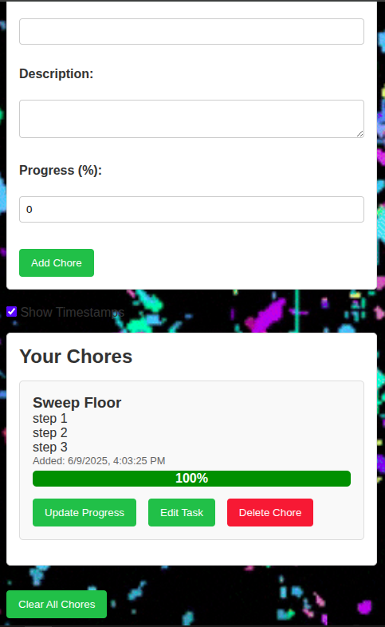

# 🧹 Family Chore Tracker

A simple, browser-based web app to help your household keep track of chores — built with vanilla HTML, CSS, and JavaScript.

---

## ✨ Features

- ✅ Add chores with a title, description, and progress percentage.
- 📝 Edit or delete existing chores.
- 📊 Track progress visually with a color-coded progress bar.
- ⏰ Optional timestamp display (with persistent toggle checkbox).
- 🔁 Save and restore chores using `localStorage`.
- 🧼 "Clear All Chores" button to reset the list (also hides timestamp toggle).
- 🧽 Auto-clears input form after submission.
- 🎉 Confetti trigger when a task hits 100% progress.
- 🔐 Safe rendering of limited HTML tags (`<em>`, `<strong>`, `<a href="...">`) in chore descriptions.
- 🍞 Toast notification when all chores are cleared.

---

## 🚀 Getting Started

### 🗂️ Project Structure

```

housechores/
├── index.html
├── styles.css
└── script.js

```

### 🧰 Requirements

- A modern web browser (Chrome, Firefox, Safari, etc.)
- No build steps, no frameworks — just open `index.html` in your browser.

---

## 🧑‍💻 Usage

1. Open `index.html` in your browser.
2. Fill in the **Chore Title**, **Description** (supports line breaks and safe HTML), and **Progress**.
3. Click **Add Chore**.
4. Use the buttons to update, edit, or delete chores.
5. Toggle the timestamp visibility using the checkbox (only appears if chores exist).
6. Click **Clear All Chores** to reset the list and hide timestamp options.

---

## 🔒 Safe Description Rendering

The app uses a simple sanitizer to prevent unwanted or unsafe HTML in descriptions while still allowing:

- `<em>` for emphasis
- `<strong>` for bold text
- `<a href="...">` for links (`http`, `https`, or `mailto`)

Newlines (`\n`) in the description are automatically converted to `<br>` elements for formatting.

---

## 💡 Potential Future Features

- Light/dark mode toggle
- Server-side backend for chore sync and notifications
- Recurring chore schedules
- User accounts and chore assignment
- Better WYSIWYG editing (e.g., Markdown or a rich-text editor)

---

## 📦 Notes

- No external libraries or dependencies
- All data is stored in `localStorage`
- This is a personal/family tool — not intended for production or public hosting (yet!)

---

## 🧠 Learnings & Practices

- DOM manipulation
- Event delegation
- Safe user input handling
- Client-side persistence with `localStorage`
- Basic security practices like input sanitization

---

## 📸 Screenshot




---

## 🧑‍🎓 Author

Made for my family — and maybe yours too.